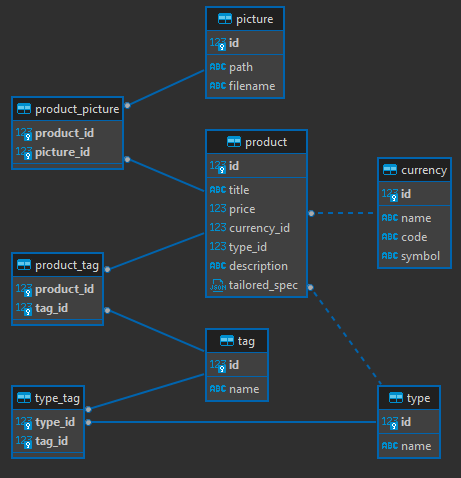

# portal-back - Le backend du portail pour tous les besoins d'Itavsa

## Sommaire

- [I - Contexte](#i---contexte)
- [II - Résultats](#ii---résultats)
- [III - Technologies utilisées](#iii---technologies-utilisées)

## I - Contexte

Afin de pouvoir vendre ses produits et services, Itavsa a besoin d'un site web.

C'est ici qu'intervient le portail qui, même s'il ne ressemble pour l'instant qu'à un site marchand comme un autre, pourra évoluer en quelque-chose de bien plus grand.

Le projet *portal-back* s'inscrit dans ce sens en permettant de servir une API REST grâce à un backend Spring Boot communiquant avec une base de données PostgreSQL.

## II - Résultats

Diagramme de la base de données (créée à l'aide de changelogs Liquibase) :

## III - Technologies utilisées

Cette application a été developpée avec l'aide de [Spring Boot](https://spring.io/), [Liquibase](https://www.liquibase.org/) et [PostgreSQL](https://www.postgresql.org/). Elle est packagée sous forme d'image [Docker](https://www.docker.com/).

D'ailleurs, à chaque commit sur la branche `main`, l'image est poussée dans le [registry GitHub associé au projet](https://github.com/Itavsa/portal-back/pkgs/container/portal-back) grâce à une [GitHub Action](https://github.com/Itavsa/portal-back/blob/main/.github/workflows/docker-image.yml).
